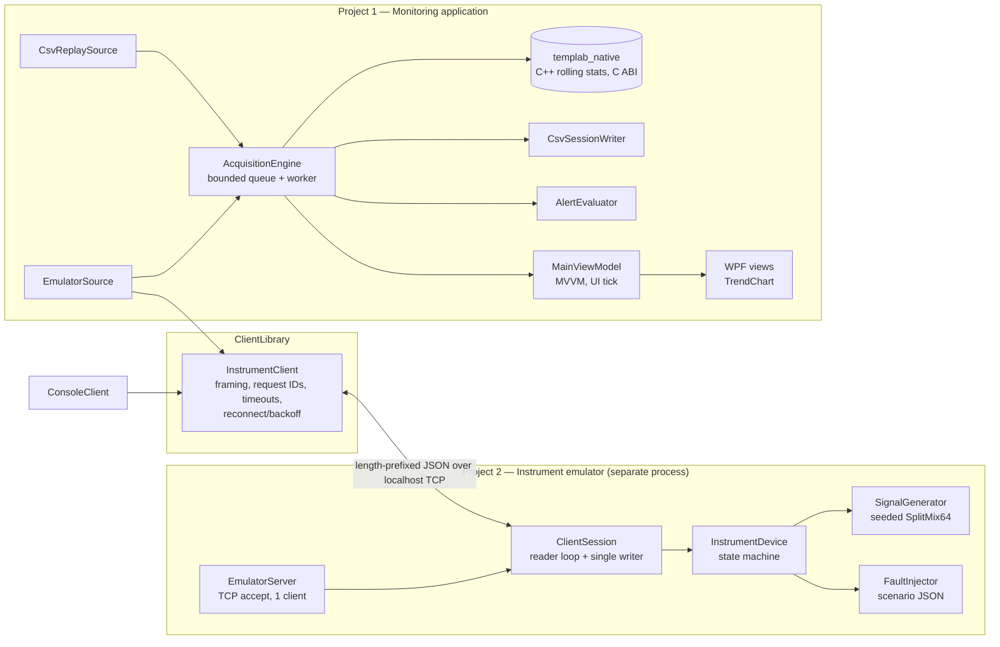
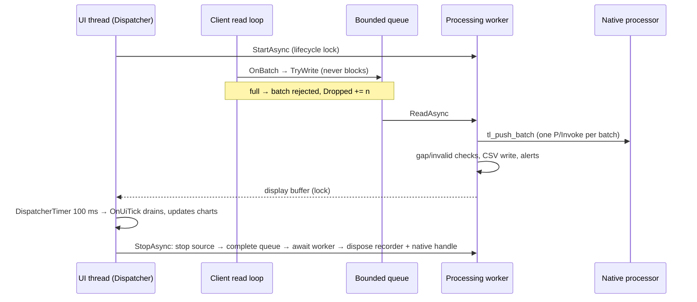

# Architecture and threading

## Components



Project boundaries are enforced by project references: the emulator does not reference the client or the
desktop app; the WPF project only references `TempLab.Presentation`; `TempLab.Presentation` is plain `net10.0`
so view models are unit-tested without a window.

## Threads and ownership



| Operation | Thread | Notes |
|---|---|---|
| Socket reads, frame decoding, response matching | Client read loop (`InstrumentClient.ReadLoopAsync`) | Raises `SamplesReceived`; handler only converts and enqueues. |
| Socket writes | Caller, serialised by `_writeLock` | One buffer per frame; frames never interleave. |
| Queue → statistics, alerts, gap checks, CSV recording | Processing worker (`AcquisitionEngine.WorkerLoopAsync`) | Sole owner of the native handle, alert evaluators, sequence map and recorder. No locks needed on them. |
| Display / alert / event buffers | Worker writes, UI drains | One lock (`_displayGate`), held only for enqueue/dequeue. |
| Charts, collections, bindable properties | UI thread | `OnUiTick` every 100 ms; connection-state events marshalled with `IUiDispatcher`. |
| Start / Stop | Any (UI in practice), serialised by `_lifecycle` | Duplicate start throws; stop is idempotent. |
| Emulator commands | Session reader loop, serialised by `_commandLock` | Generator never takes this lock; it takes `_stateGate` briefly, so `stop` can await the generator without deadlock. |
| Emulator frame writes | Session writer task (single reader of the outbound channel) | Sample frames bounded at 256; overflow → device `Faulted` with `BufferOverflow`. |

## Overflow and loss policy

| Where | Policy | Visible as |
|---|---|---|
| Client → engine queue (`QueueCapacityBatches`, default 256) | Reject the **newest** batch when full (the network thread never blocks) | `Dropped` counter, `queue_overflow` log. `Received = Processed + Dropped` after stop. |
| Engine → UI display buffer (`DisplayBufferCapacity`, 20 000) | Drop the **oldest** display points | `DisplaySkipped`; processing and recording are unaffected. |
| Chart history (600 points per channel) | Ring buffer overwrites oldest | Bounded memory in long sessions. |
| Device outbound sample frames (256) | Stop acquisition explicitly: device enters `Faulted (BufferOverflow)` and sends `deviceFault` | Status/fault event; requires `reset`. |

Dropped batches are not recorded (the recorder is on the worker), so a replay of a recording reproduces exactly
what the live pipeline processed. Gaps from the device (sequence jumps) are counted and written to the
recording as `# event=gap` lines.

## Native boundary

`NativeProcessing/include/templab/rolling_stats.h` is the whole contract:

- Opaque `tl_processor*` created by `tl_create`, released by `tl_destroy`. The managed side wraps it in
  `RollingStatsSafeHandle` (a real native handle, so `SafeHandle` is appropriate) and disposes it on stop.
- Fixed-width types only (`int32_t`, `double`, a 40-byte POD `tl_stats`; size checked by a test on both sides).
- Buffers are passed as pointer + `int32_t` count; `tl_push_batch` checks the output capacity and validates every
  channel before changing state, so a bad batch has no partial effect.
- Every entry point is wrapped in `try/catch (...)` and returns a status code. `TL_INVALID_VALUE` is a normal,
  non-error result for samples rejected by the invalid-data policy.
- Algorithm: ring buffer + running sum (re-summed every `W` pushes to bound floating-point drift) + monotonic
  deques for min/max: O(1) amortised per sample, O(W) memory per channel.

## Start/stop lifecycle

```
Idle ──Start──▶ Starting ──source started──▶ Running ──Stop──▶ Stopping ──▶ Idle
                    │                            │
                    └── failure: tear down ──────┴── worker exception ──▶ Faulted ──Stop──▶ Idle
```

Stop order: stop the source (emulator `stop` is acknowledged only after the device generator has finished, so
no more batches can arrive) → complete the queue → await the worker draining it → dispose the CSV writer → dispose
the native handle. Tests run 20 start/stop cycles and check the recording file can be opened exclusively afterwards.
